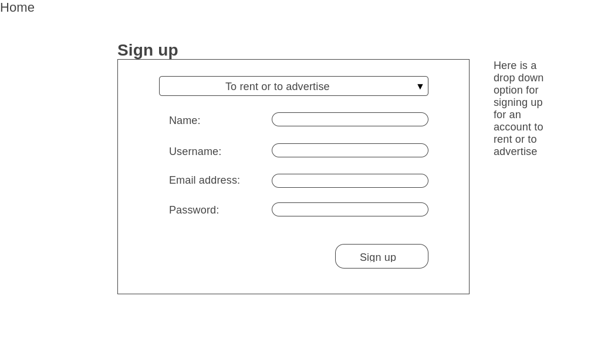
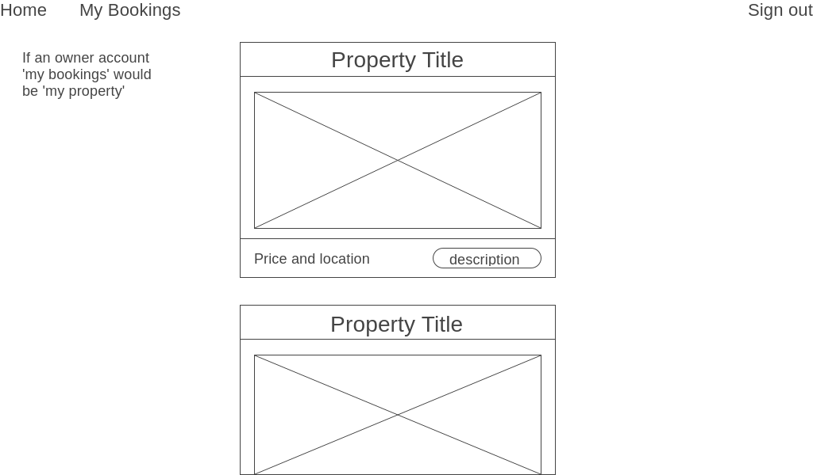
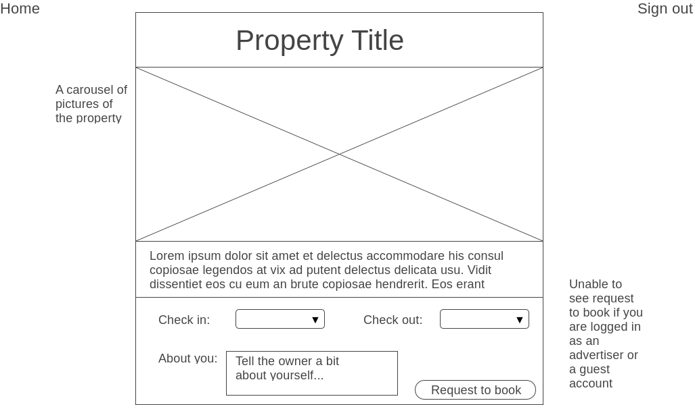
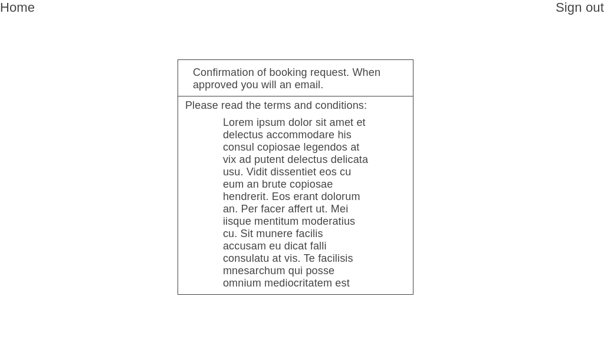
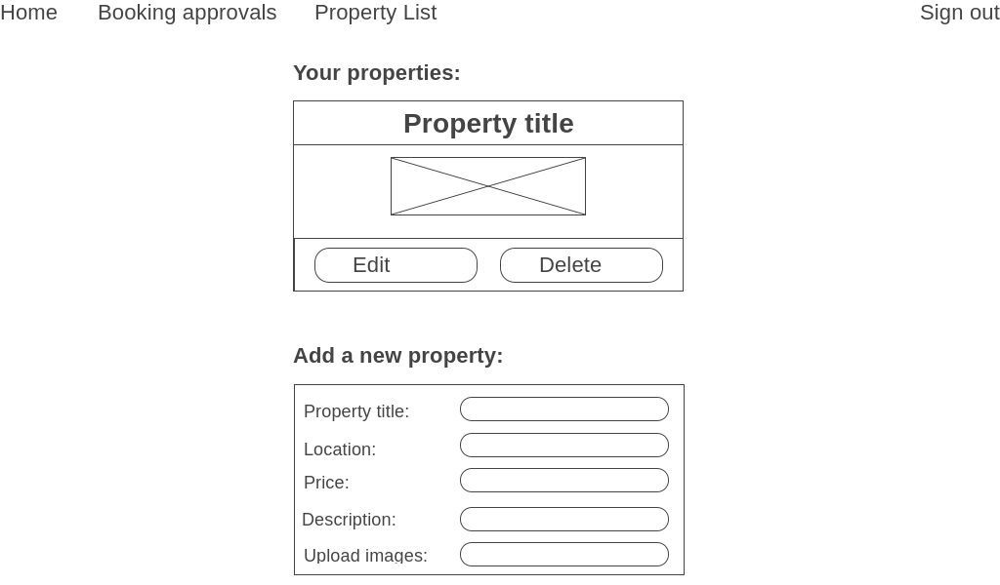
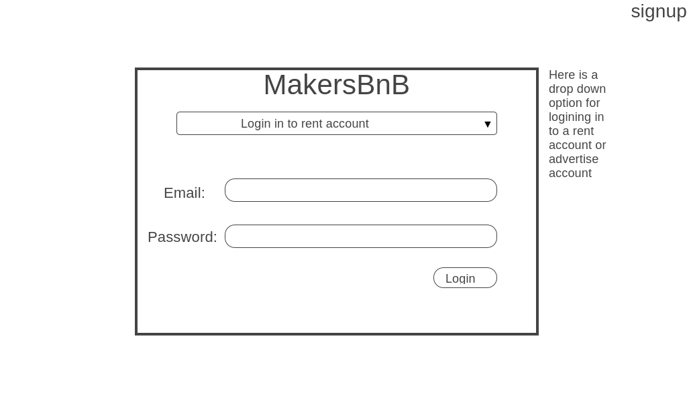
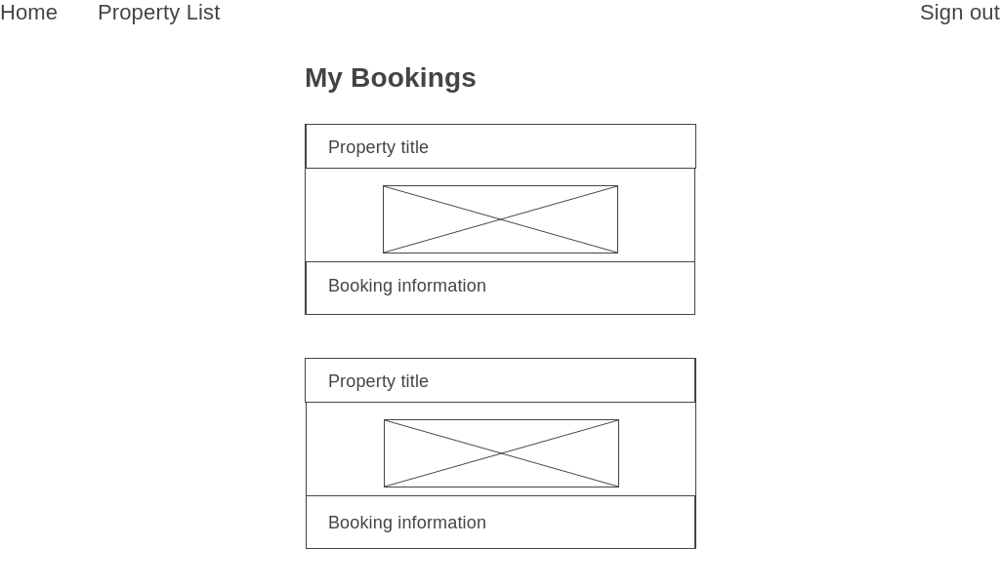
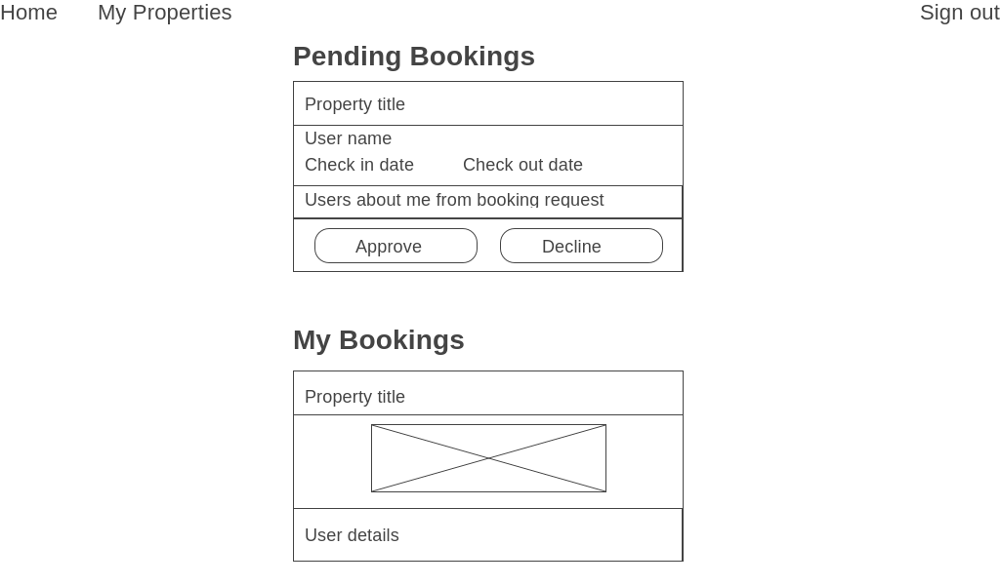

# Makers BnB

* TBC

-----
**User Stories:**


* Any signed-up user can list a new space.

```
As a property owner,
So I can advertise my property
I want to add a new listing.
```

* Users can list multiple spaces.

```
As a property owner,
So I can advertise all my properties,
I want to be able to have multiple listings.
```

* Users should be able to name their space, provide a short description of the space, and a price per night.

```
As a property owner,
So I can find my listing,
I want to be able to give it a name.
```
```
As a property owner,
So I can make my listing more desirable,
I want to be able to add a description.
```
```
As a property owner,
So I can advertise my property,
I would like to be able to assign a price.
```

* Users should be able to offer a range of dates where their space is available.

```
As a property owner,
So I can manage my bookings,
I want to be able to display available dates.
```

* Any signed-up user can request to hire any space for one night, and this should be approved by the user that owns that space.

```
As a customer,
So I can request to hire any space for one night,
I want the property owner to be able to approve it.
```

* Nights for which a space has already been booked should not be available for users to book that space.

```
As a customer,
So I can book a place to stay,
I want to only be able to book an available space on a specific date.
```

* Until a user has confirmed a booking request, that space can still be booked for that night.

```
As a property owner,
So I can choose who to rent my property to,
I want my property to remain advertised until I have approved booking.
```

## Original wireframe

Sign up page:



Property list:



Property details:



Confirmation:



My properties (additional for owner experience):



## Additions to wireframe

Once the original wireframes were completed, we were able to add extra functionality to complete our users stories:

Login:



My bookings:



Pending bookings (additional for owner experience):



## Database migration

- [Link to our database setup and migration guide](https://github.com/JakePEGG/makers_bnb/blob/master/db/migration)
